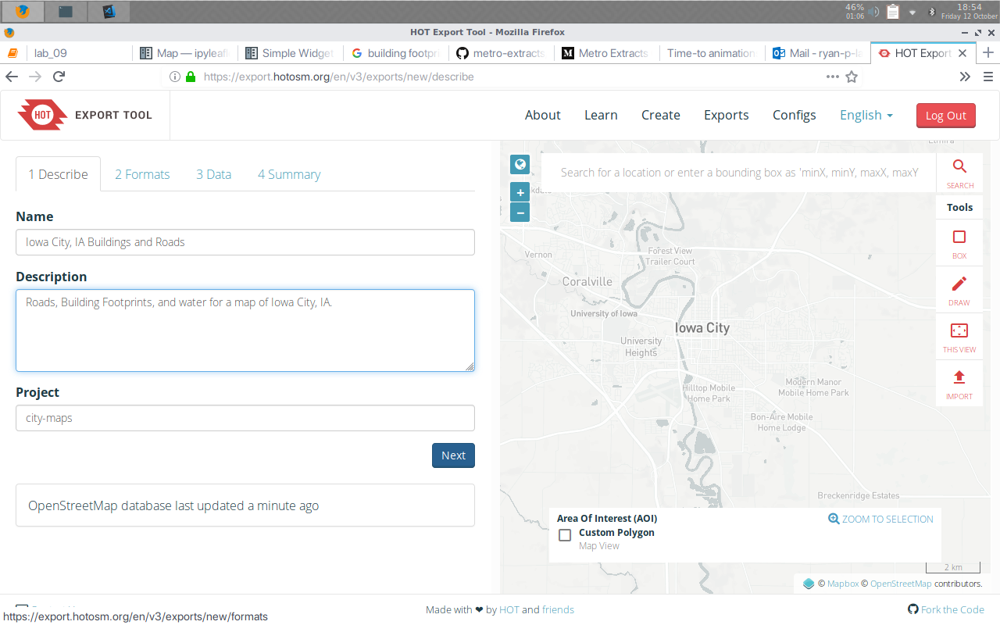

# City-Maps

## Introduction

*To be filled.*

## Step 0: Setup

*Checkout git branch `00-setup` to follow along*.

1. Create a repository on Github.
2. Download repo and change directories into it:
    `git clone xxx@github.com/yyy/repos/zzz && cd zzz`
3. Create directories using the `mkdir` command for the notebook/scripts, data, and final outputs: 
    `mkdir src data output`.
4. Create a README file using `echo` to write text to a Markdown file: 
    `echo '# City-Maps' >> README.md`
5. Create a `Makefile` using the `touch` command:
    `touch Makefile`
6. Create a new Python environment using `conda`
    - Add the 'Conda Forge' channel to `.condarc` to fix Geopandas issue with mixing channels: `conda config --add channels conda-forge`
    - Create a new conda environment, installing Geopandas and Jupyter packages: `conda create -n city-maps -c conda-forge python=3.6 geopandas jupyter`
    - Export Conda environment: `conda env export > environment.yml`
7. Add base files to git:
    `git add Makefile README.md environment.yml`

## Step 1: Data Acquistition

*Checkout git branch `01-data` to follow along*.

**Google Takeout Data**
1. Download location history from Google Takeout to the `/data/` directory and modify the Makefile variable '`GOOGLE_TAKEOUT_ZIP`' to match the name of the downloaded file.

2. Extract location data from downloaded `.zip` file with our `Makefile`: `make data/Takeout`

**Iowa County Data** (so we can filter the locations)

1. Download and extract the IA County data with the following Makefile command: `make data/counties/county.shp`

**Johnson County Location History**

1. Run the make command to merge the location history with the county shapefile: `make data/johnson-cnty-coords.csv`

## Step 2: Data Formatting

*Checkout git branch `02-formatting` to follow along*.

**Create Functions to parse and format our data**. See [the notebook](/docs/02-formatting.ipynb) for a step by step tutorial on how the formatting script was made.

Run `make data/johnson-county-coords.csv` to format our data in this step.

## Step 3: Map Data Acquisition

*Checkout git branch `03-initial-mapping` to follow along*.

I downloaded an Open Streets Map extract using HOT Export. You could use any similar geographic shapefile as a base map though.

I converted the shapefiles to GeoJSON using QGis, but it could easily be done using OGR2OGR or another command line utility.

