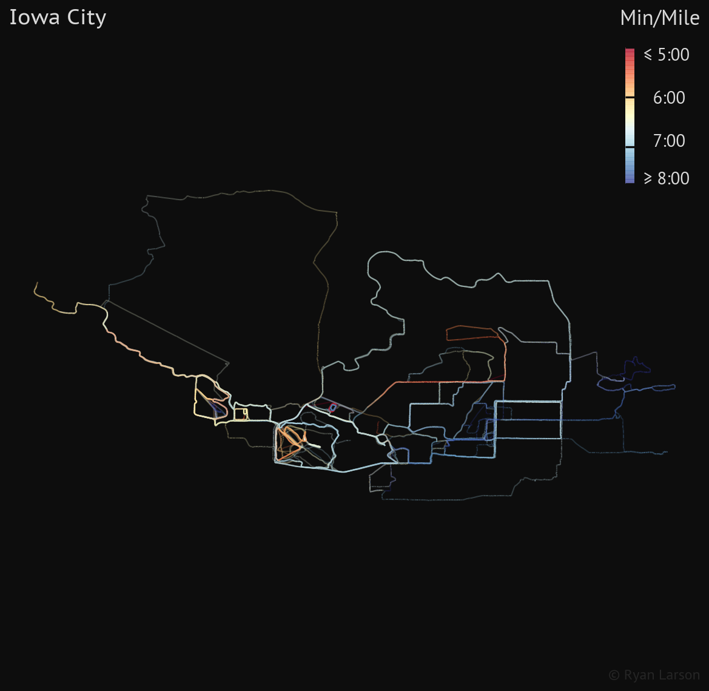
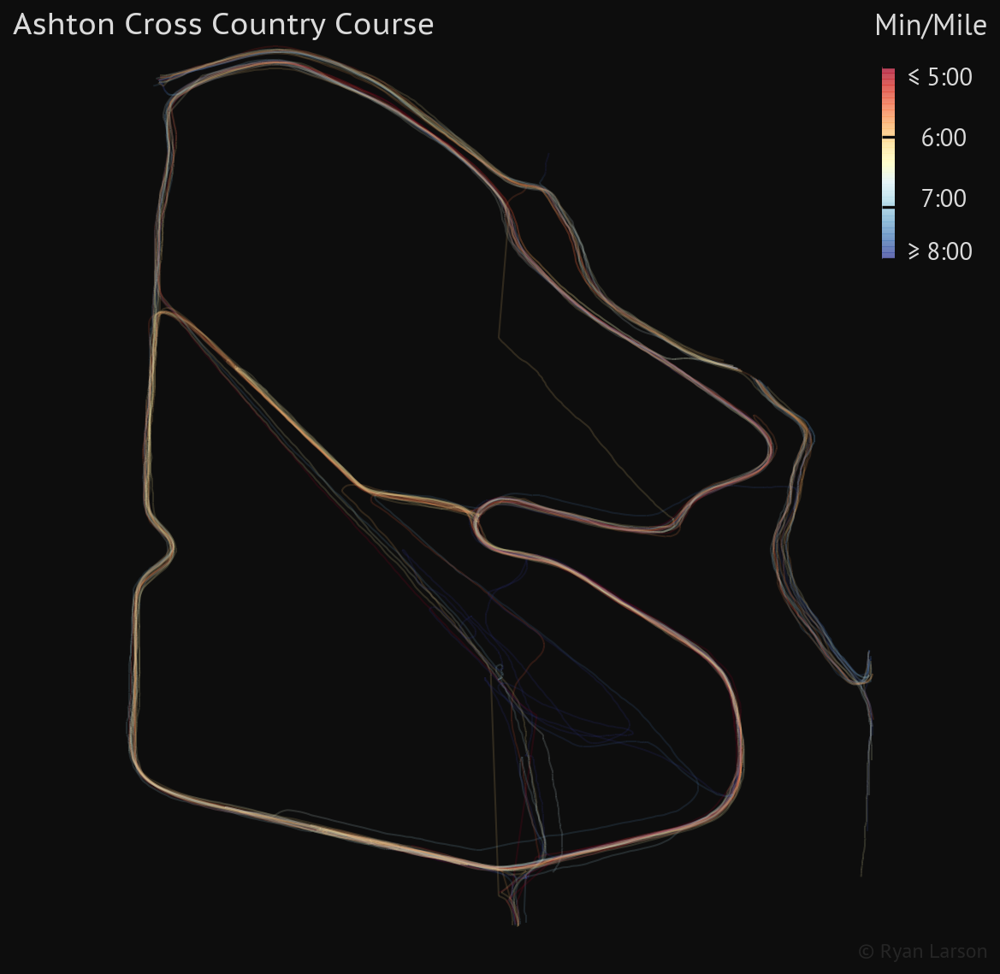
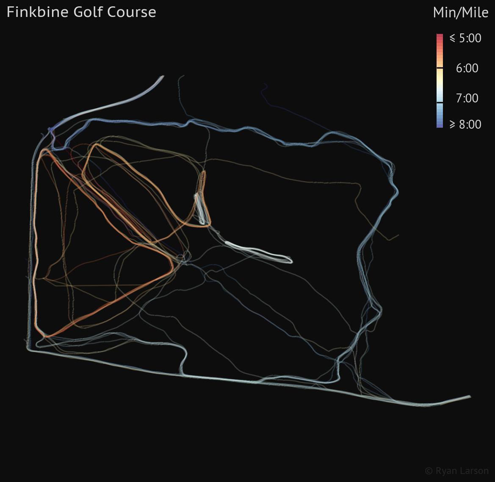
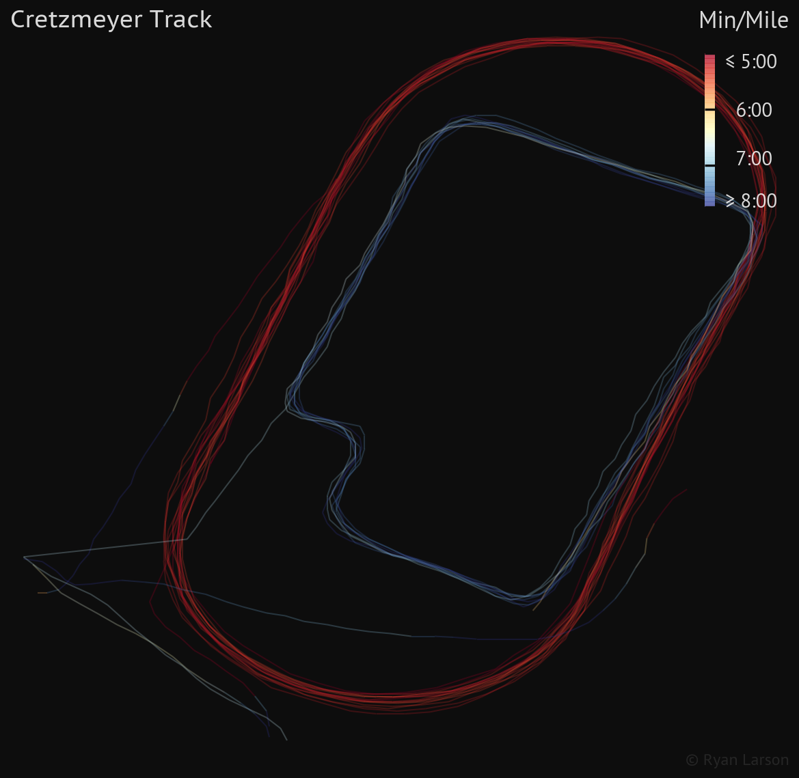
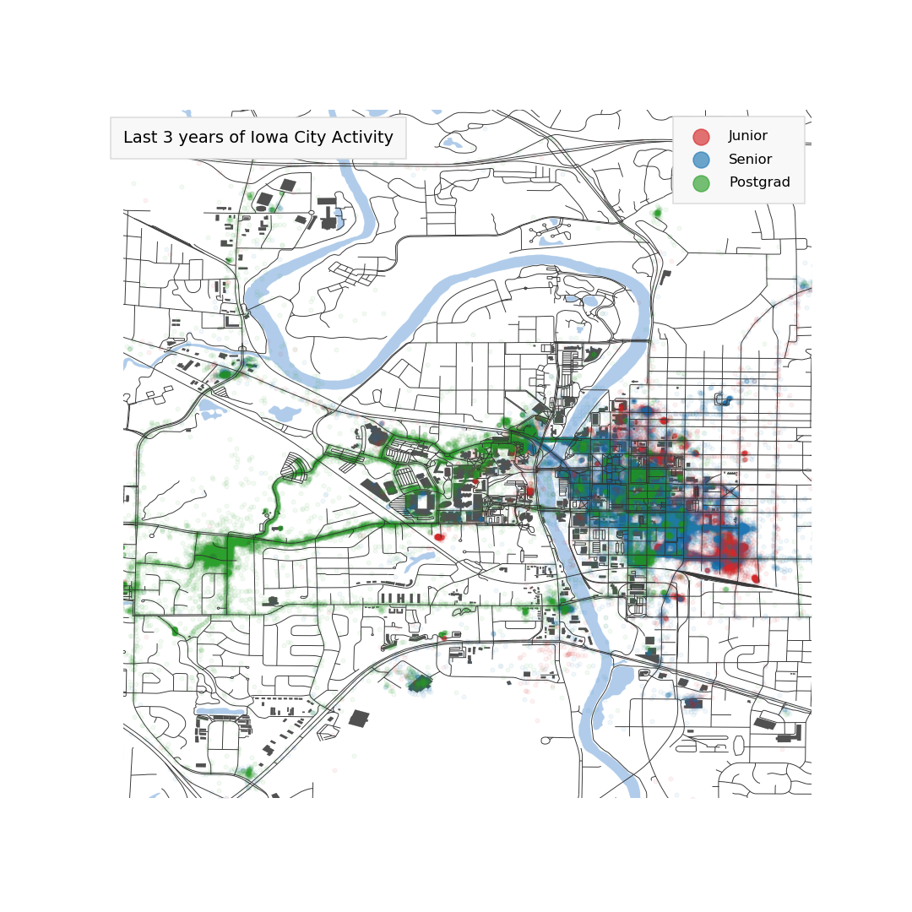
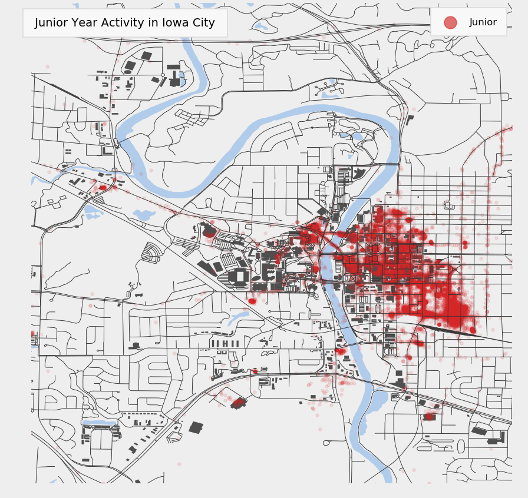
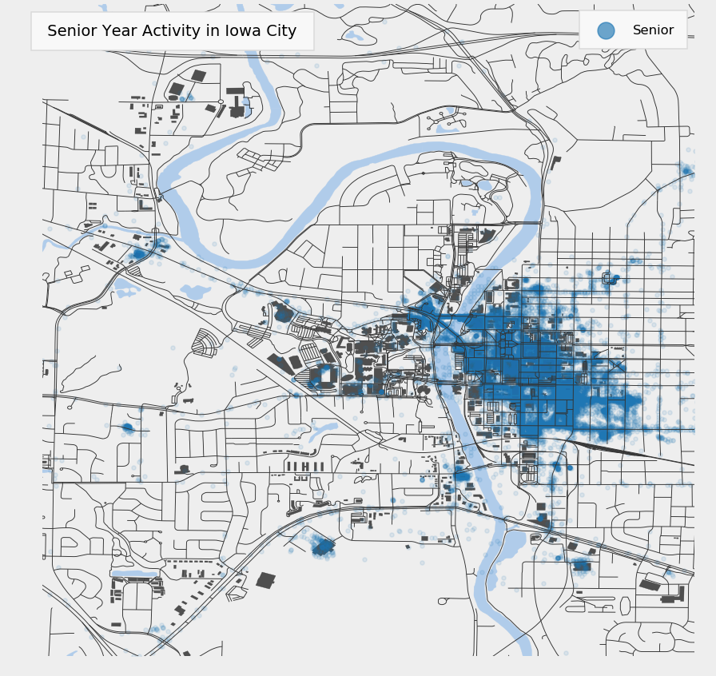
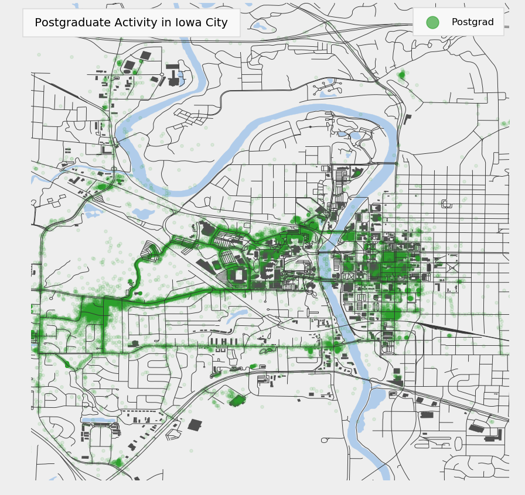

# City-Maps

Maps from location and gps trace data. View the uncompleted tutorial [here](TUTORIAL.md). Made with...
- Python 🐍 
- Matplotlib
- Jupyter 📔
- 👟, 💦, 💛

**Maps:**
- [Running](#running)
- [Locations](#locations)

## <a id="running" href="#"/> Running

</img>

</img>

</img>

</img>

## <a id="locations" href="#">GPS Locations</a>

</img>

</img>

</img>

</img>
